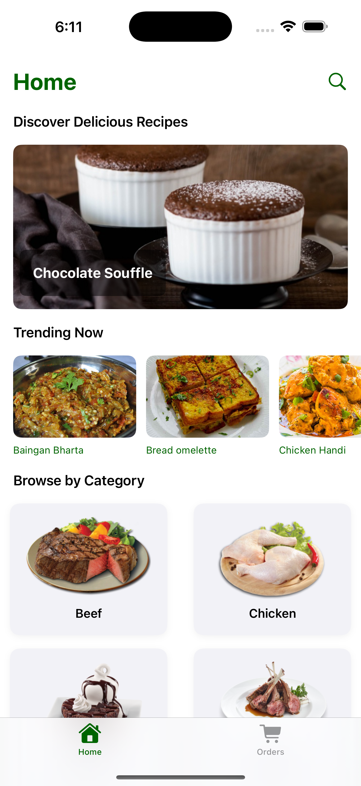
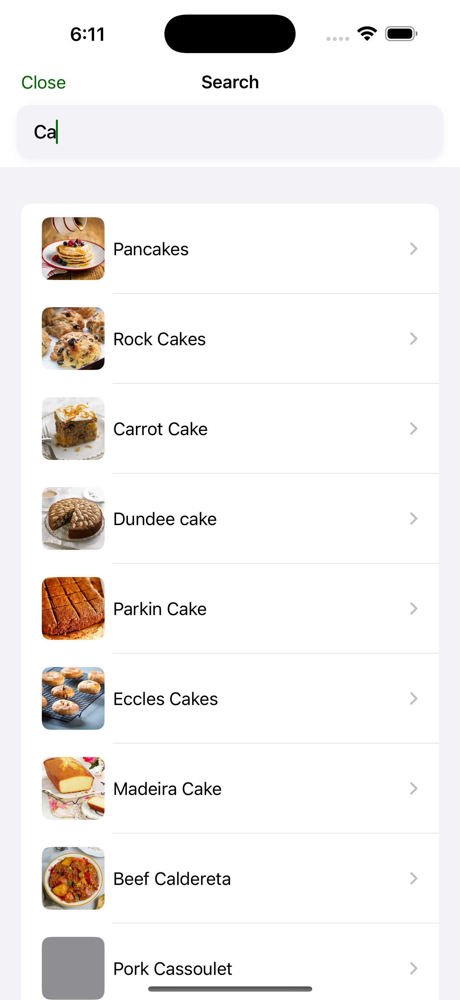
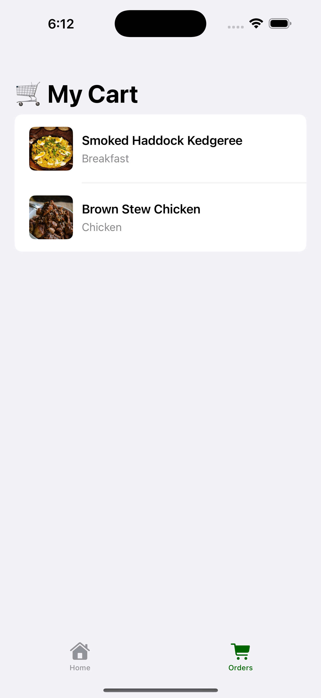
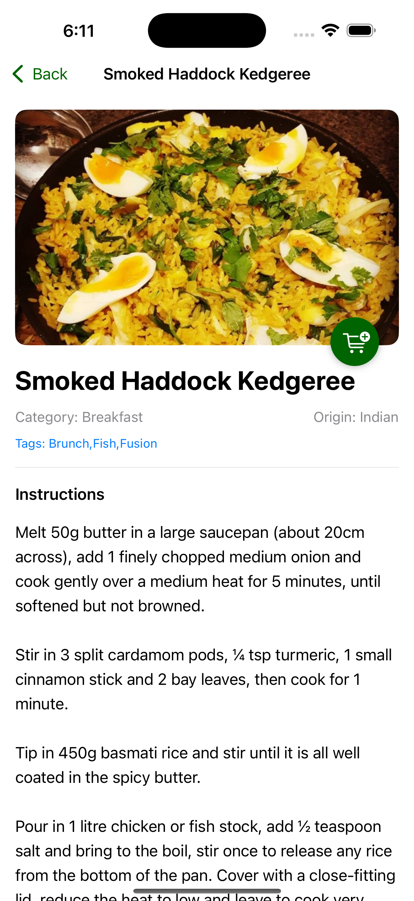

# 🍔 Appetizers – A SwiftUI iOS App

🚀 Just wrapped up building a **SwiftUI-based iOS app: Appetizers 🍽️!**

This project demonstrates how declarative UI, local storage, and seamless multimedia integration can deliver a polished, responsive user experience on iOS.

---

## 📸 Screenshots

| Home | Search | Orders | Details |
|:----:|:------:|:------:|:-------:|
|  |  |  |  |

---

## ✨ Features

- ✅ Built entirely using **SwiftUI**
- 🔄 Shared cart state using `@EnvironmentObject`
- 💾 Cart items are persisted locally via `UserDefaults`
- 📺 YouTube tutorial integration using `UIViewRepresentable`-based **WebView**
- 🔎 Search functionality to filter meals by name
- 📦 Async image loading and clean UI
- 🛒 Floating **Add to Cart** button

---

## 🧠 What You'll Learn

- Declarative UI building with SwiftUI
- State management using `@EnvironmentObject`
- SwiftUI + UIKit interoperability (`UIViewRepresentable`)
- Persisting lightweight data using `UserDefaults`
- Working with async image loading and conditional UI

---

## 🛠️ Technologies

- Swift 5
- SwiftUI
- Xcode 15+
- UIKit (for WebView)
- MVVM architecture
